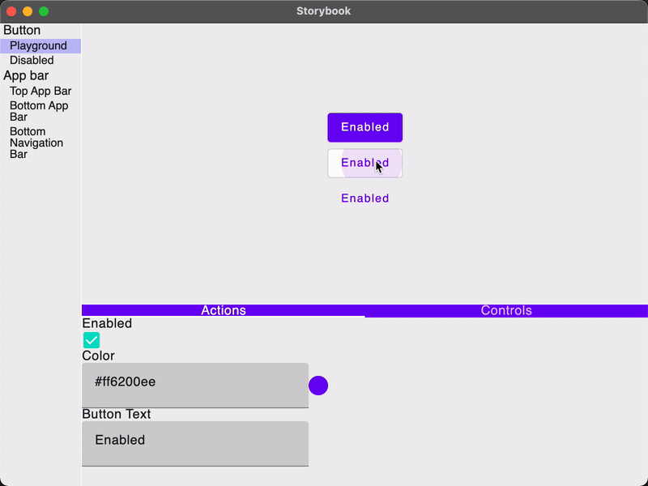

# Storybook Compose (WIP)

Storybook is a development environment for UI components. It allows you to browse a component library, view the
different states of each component, and interactively develop and test components. Storybook Compose is powered by
Jetpack Compose and Kotlin multiplatform, so you can build UI library for Desktop and Android.

  

_Storybook Compose_ is heavily inspired by [Storybook.js](https://github.com/storybookjs/storybook)
